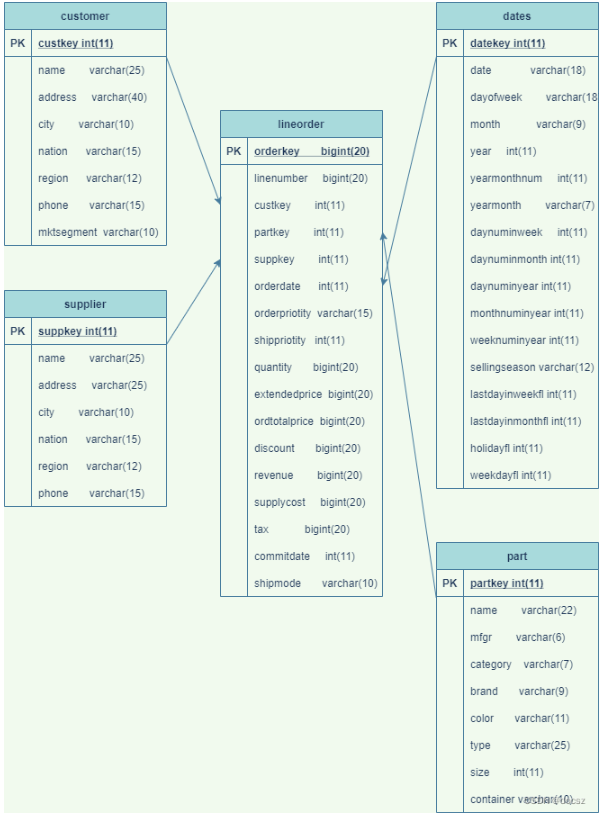

#SSB测试mysql

#1、SSB简介
SSB（Star Schema Benchmark）是麻省州立大学波士顿校区的研究人员定义的基于现实商业应用的数据模型，业界公认用来模拟决策支持类应用，比较公正和中立。学术界和工业界普遍采用它来评价决策支持技术方面应用的性能。全方位评测系统的整体商业计算综合能力，对厂商的要求更高。在银行信贷分析和信用卡分析、电信运营分析、税收分析、烟草行业决策分析中都有广泛的应用。

● SSB基准测试包括：

1个事实表：lineorder；
4个维度表：customer，part，dwdate，supplier；
13条标准SQL查询测试语句：统计查询、多表关联、sum、复杂条件、group by、order by等组合方式。



#2、生成数据
安装源码并生成数据：

```
#下载编译
wget https://starrocks-public.oss-cn-zhangjiakou.aliyuncs.com/ssb-poc-0.9.3.zip
unzip ssb-poc-0.9.3.zip
cd ssb-poc-0.9.3/ssb-poc
make && make install

# 生成数据，切换到output目录下：
chmod a+x bin/*
bin/gen-ssb.sh 10 data_dir (10表示生成10G左右的数据,当需要生成的数据较大时，lineorder表的数据最多，会根据数据量生成多个约1G级的数据文件lineorder.tbl.1、lineorder.tbl.2等等，以便后面比较友好的进行导入。)
```

#3、创建数据表
##a、创建表结构
```SQL
CREATE TABLE IF NOT EXISTS `lineorder` (
  `lo_orderkey` int NOT NULL COMMENT "",
  `lo_linenumber` int NOT NULL COMMENT "",
  `lo_custkey` int NOT NULL COMMENT "",
  `lo_partkey` int NOT NULL COMMENT "",
  `lo_suppkey` int NOT NULL COMMENT "",
  `lo_orderdate` int NOT NULL COMMENT "",
  `lo_orderpriority` varchar(16) NOT NULL COMMENT "",
  `lo_shippriority` int NOT NULL COMMENT "",
  `lo_quantity` int NOT NULL COMMENT "",
  `lo_extendedprice` int NOT NULL COMMENT "",
  `lo_ordtotalprice` int NOT NULL COMMENT "",
  `lo_discount` int NOT NULL COMMENT "",
  `lo_revenue` int NOT NULL COMMENT "",
  `lo_supplycost` int NOT NULL COMMENT "",
  `lo_tax` int NOT NULL COMMENT "",
  `lo_commitdate` int NOT NULL COMMENT "",
  `lo_shipmode` varchar(11) NOT NULL COMMENT ""
);

CREATE TABLE IF NOT EXISTS `customer` (
  `c_custkey` int(11) NOT NULL COMMENT "",
  `c_name` varchar(26) NOT NULL COMMENT "",
  `c_address` varchar(41) NOT NULL COMMENT "",
  `c_city` varchar(11) NOT NULL COMMENT "",
  `c_nation` varchar(16) NOT NULL COMMENT "",
  `c_region` varchar(13) NOT NULL COMMENT "",
  `c_phone` varchar(16) NOT NULL COMMENT "",
  `c_mktsegment` varchar(11) NOT NULL COMMENT ""
);

CREATE TABLE IF NOT EXISTS `dates` (
  `d_datekey` int(11) NOT NULL COMMENT "",
  `d_date` varchar(20) NOT NULL COMMENT "",
  `d_dayofweek` varchar(10) NOT NULL COMMENT "",
  `d_month` varchar(11) NOT NULL COMMENT "",
  `d_year` int(11) NOT NULL COMMENT "",
  `d_yearmonthnum` int(11) NOT NULL COMMENT "",
  `d_yearmonth` varchar(9) NOT NULL COMMENT "",
  `d_daynuminweek` int(11) NOT NULL COMMENT "",
  `d_daynuminmonth` int(11) NOT NULL COMMENT "",
  `d_daynuminyear` int(11) NOT NULL COMMENT "",
  `d_monthnuminyear` int(11) NOT NULL COMMENT "",
  `d_weeknuminyear` int(11) NOT NULL COMMENT "",
  `d_sellingseason` varchar(14) NOT NULL COMMENT "",
  `d_lastdayinweekfl` int(11) NOT NULL COMMENT "",
  `d_lastdayinmonthfl` int(11) NOT NULL COMMENT "",
  `d_holidayfl` int(11) NOT NULL COMMENT "",
  `d_weekdayfl` int(11) NOT NULL COMMENT ""
);

CREATE TABLE IF NOT EXISTS `supplier` (
  `s_suppkey` int(11) NOT NULL COMMENT "",
  `s_name` varchar(26) NOT NULL COMMENT "",
  `s_address` varchar(26) NOT NULL COMMENT "",
  `s_city` varchar(11) NOT NULL COMMENT "",
  `s_nation` varchar(16) NOT NULL COMMENT "",
  `s_region` varchar(13) NOT NULL COMMENT "",
  `s_phone` varchar(16) NOT NULL COMMENT ""
);

CREATE TABLE IF NOT EXISTS `part` (
  `p_partkey` int(11) NOT NULL COMMENT "",
  `p_name` varchar(23) NOT NULL COMMENT "",
  `p_mfgr` varchar(7) NOT NULL COMMENT "",
  `p_category` varchar(8) NOT NULL COMMENT "",
  `p_brand` varchar(10) NOT NULL COMMENT "",
  `p_color` varchar(12) NOT NULL COMMENT "",
  `p_type` varchar(26) NOT NULL COMMENT "",
  `p_size` int(11) NOT NULL COMMENT "",
  `p_container` varchar(11) NOT NULL COMMENT ""
);

CREATE TABLE IF NOT EXISTS `lineorder_flat` (
  `LO_ORDERDATE` date NOT NULL COMMENT '',
  `LO_ORDERKEY` int(11) NOT NULL COMMENT '',
  `LO_LINENUMBER` tinyint(4) NOT NULL COMMENT '',
  `LO_CUSTKEY` int(11) NOT NULL COMMENT '',
  `LO_PARTKEY` int(11) NOT NULL COMMENT '',
  `LO_SUPPKEY` int(11) NOT NULL COMMENT '',
  `LO_ORDERPRIORITY` varchar(100) NOT NULL COMMENT '',
  `LO_SHIPPRIORITY` tinyint(4) NOT NULL COMMENT '',
  `LO_QUANTITY` tinyint(4) NOT NULL COMMENT '',
  `LO_EXTENDEDPRICE` int(11) NOT NULL COMMENT '',
  `LO_ORDTOTALPRICE` int(11) NOT NULL COMMENT '',
  `LO_DISCOUNT` tinyint(4) NOT NULL COMMENT '',
  `LO_REVENUE` int(11) NOT NULL COMMENT '',
  `LO_SUPPLYCOST` int(11) NOT NULL COMMENT '',
  `LO_TAX` tinyint(4) NOT NULL COMMENT '',
  `LO_COMMITDATE` date NOT NULL COMMENT '',
  `LO_SHIPMODE` varchar(100) NOT NULL COMMENT '',
  `C_NAME` varchar(100) NOT NULL COMMENT '',
  `C_ADDRESS` varchar(100) NOT NULL COMMENT '',
  `C_CITY` varchar(100) NOT NULL COMMENT '',
  `C_NATION` varchar(100) NOT NULL COMMENT '',
  `C_REGION` varchar(100) NOT NULL COMMENT '',
  `C_PHONE` varchar(100) NOT NULL COMMENT '',
  `C_MKTSEGMENT` varchar(100) NOT NULL COMMENT '',
  `S_NAME` varchar(100) NOT NULL COMMENT '',
  `S_ADDRESS` varchar(100) NOT NULL COMMENT '',
  `S_CITY` varchar(100) NOT NULL COMMENT '',
  `S_NATION` varchar(100) NOT NULL COMMENT '',
  `S_REGION` varchar(100) NOT NULL COMMENT '',
  `S_PHONE` varchar(100) NOT NULL COMMENT '',
  `P_NAME` varchar(100) NOT NULL COMMENT '',
  `P_MFGR` varchar(100) NOT NULL COMMENT '',
  `P_CATEGORY` varchar(100) NOT NULL COMMENT '',
  `P_BRAND` varchar(100) NOT NULL COMMENT '',
  `P_COLOR` varchar(100) NOT NULL COMMENT '',
  `P_TYPE` varchar(100) NOT NULL COMMENT '',
  `P_SIZE` tinyint(4) NOT NULL COMMENT '',
  `P_CONTAINER` varchar(100) NOT NULL COMMENT ''
);
```

##b、数据导入
1、表中导入数据

```SQL
load data local infile '~/customer.tbl' into table customer fields terminated by '|';
load data local infile '~/dates.tbl' into table dates fields terminated by '|';
load data local infile '~/part.tbl' into table part fields terminated by '|';
load data local infile '~/supplier.tbl' into table supplier fields terminated by '|';
load data local infile '~/lineorder.tbl' into table lineorder fields terminated by '|';
```

2、导入数据到宽表lineorder_flat

```
select `LO_ORDERDATE` , `LO_ORDERKEY` , `LO_LINENUMBER` , `LO_CUSTKEY` , `LO_PARTKEY` , `LO_SUPPKEY` , `LO_ORDERPRIORITY` , `LO_SHIPPRIORITY` , `LO_QUANTITY` , `LO_EXTENDEDPRICE` , `LO_ORDTOTALPRICE` , `LO_DISCOUNT` , `LO_REVENUE` , `LO_SUPPLYCOST` , `LO_TAX` , `LO_COMMITDATE` , `LO_SHIPMODE` , `C_NAME` , `C_ADDRESS` , `C_CITY` , `C_NATION` , `C_REGION` , `C_PHONE` , `C_MKTSEGMENT` , `S_NAME` , `S_ADDRESS` , `S_CITY` , `S_NATION` , `S_REGION` , `S_PHONE` , `P_NAME` , `P_MFGR` , `P_CATEGORY` , `P_BRAND` , `P_COLOR` , `P_TYPE` , `P_SIZE` , `P_CONTAINER` from lineorder l INNER JOIN customer c ON (c.C_CUSTKEY = l.LO_CUSTKEY)  INNER JOIN supplier s ON (s.S_SUPPKEY = l.LO_SUPPKEY)  INNER JOIN part p ON  (p.P_PARTKEY = l.LO_PARTKEY) where lo_orderdate <19940101
INTO OUTFILE '/data/data_10g_ssb/lineorder_flat_19940101.csv'
FIELDS TERMINATED BY '|' LINES TERMINATED BY '\n';

select `LO_ORDERDATE` , `LO_ORDERKEY` , `LO_LINENUMBER` , `LO_CUSTKEY` , `LO_PARTKEY` , `LO_SUPPKEY` , `LO_ORDERPRIORITY` , `LO_SHIPPRIORITY` , `LO_QUANTITY` , `LO_EXTENDEDPRICE` , `LO_ORDTOTALPRICE` , `LO_DISCOUNT` , `LO_REVENUE` , `LO_SUPPLYCOST` , `LO_TAX` , `LO_COMMITDATE` , `LO_SHIPMODE` , `C_NAME` , `C_ADDRESS` , `C_CITY` , `C_NATION` , `C_REGION` , `C_PHONE` , `C_MKTSEGMENT` , `S_NAME` , `S_ADDRESS` , `S_CITY` , `S_NATION` , `S_REGION` , `S_PHONE` , `P_NAME` , `P_MFGR` , `P_CATEGORY` , `P_BRAND` , `P_COLOR` , `P_TYPE` , `P_SIZE` , `P_CONTAINER` from lineorder l INNER JOIN customer c ON (c.C_CUSTKEY = l.LO_CUSTKEY)  INNER JOIN supplier s ON (s.S_SUPPKEY = l.LO_SUPPKEY)  INNER JOIN part p ON  (p.P_PARTKEY = l.LO_PARTKEY) where lo_orderdate >=19940101 and lo_orderdate <19960101
INTO OUTFILE '/data/data_10g_ssb/lineorder_flat_19960101.csv'
FIELDS TERMINATED BY '|' LINES TERMINATED BY '\n';

select `LO_ORDERDATE` , `LO_ORDERKEY` , `LO_LINENUMBER` , `LO_CUSTKEY` , `LO_PARTKEY` , `LO_SUPPKEY` , `LO_ORDERPRIORITY` , `LO_SHIPPRIORITY` , `LO_QUANTITY` , `LO_EXTENDEDPRICE` , `LO_ORDTOTALPRICE` , `LO_DISCOUNT` , `LO_REVENUE` , `LO_SUPPLYCOST` , `LO_TAX` , `LO_COMMITDATE` , `LO_SHIPMODE` , `C_NAME` , `C_ADDRESS` , `C_CITY` , `C_NATION` , `C_REGION` , `C_PHONE` , `C_MKTSEGMENT` , `S_NAME` , `S_ADDRESS` , `S_CITY` , `S_NATION` , `S_REGION` , `S_PHONE` , `P_NAME` , `P_MFGR` , `P_CATEGORY` , `P_BRAND` , `P_COLOR` , `P_TYPE` , `P_SIZE` , `P_CONTAINER` from lineorder l INNER JOIN customer c ON (c.C_CUSTKEY = l.LO_CUSTKEY)  INNER JOIN supplier s ON (s.S_SUPPKEY = l.LO_SUPPKEY)  INNER JOIN part p ON  (p.P_PARTKEY = l.LO_PARTKEY) where lo_orderdate >=19960101 and lo_orderdate <19980101
INTO OUTFILE '/data/data_10g_ssb/lineorder_flat_19980101.csv'
FIELDS TERMINATED BY '|' LINES TERMINATED BY '\n';

select `LO_ORDERDATE` , `LO_ORDERKEY` , `LO_LINENUMBER` , `LO_CUSTKEY` , `LO_PARTKEY` , `LO_SUPPKEY` , `LO_ORDERPRIORITY` , `LO_SHIPPRIORITY` , `LO_QUANTITY` , `LO_EXTENDEDPRICE` , `LO_ORDTOTALPRICE` , `LO_DISCOUNT` , `LO_REVENUE` , `LO_SUPPLYCOST` , `LO_TAX` , `LO_COMMITDATE` , `LO_SHIPMODE` , `C_NAME` , `C_ADDRESS` , `C_CITY` , `C_NATION` , `C_REGION` , `C_PHONE` , `C_MKTSEGMENT` , `S_NAME` , `S_ADDRESS` , `S_CITY` , `S_NATION` , `S_REGION` , `S_PHONE` , `P_NAME` , `P_MFGR` , `P_CATEGORY` , `P_BRAND` , `P_COLOR` , `P_TYPE` , `P_SIZE` , `P_CONTAINER` from lineorder l INNER JOIN customer c ON (c.C_CUSTKEY = l.LO_CUSTKEY)  INNER JOIN supplier s ON (s.S_SUPPKEY = l.LO_SUPPKEY)  INNER JOIN part p ON  (p.P_PARTKEY = l.LO_PARTKEY) where lo_orderdate >=19980101 and lo_orderdate <19990101
INTO OUTFILE '/data/data_10g_ssb/lineorder_flat_19990101.csv'
FIELDS TERMINATED BY '|' LINES TERMINATED BY '\n';
```

load data导入到数据宽表
```
load data infile '/data/data_10g_ssb/lineorder_flat_19940101.csv' into table lineorder_flat fields terminated by '|' lines terminated by '\n';
load data infile '/data/data_10g_ssb/lineorder_flat_19960101.csv' into table lineorder_flat fields terminated by '|' lines terminated by '\n';
load data infile '/data/data_10g_ssb/lineorder_flat_19980101.csv' into table lineorder_flat fields terminated by '|' lines terminated by '\n';
load data infile '/data/data_10g_ssb/lineorder_flat_19990101.csv' into table lineorder_flat fields terminated by '|' lines terminated by '\n';
```

#4、创建索引
Mysql测试时，需创建索引
```
alter table dates add primary key (d_datekey);
alter table dates add index d_year(d_year);

alter table part add primary key (p_partkey);
alter table part add index p_brand(p_brand);

alter table supplier add primary key (s_suppkey);
alter table supplier add index s_city(s_city);
alter table supplier add index s_nation(s_nation);
alter table supplier add index s_region(s_region);

alter table customer add primary key (c_custkey);
alter table customer add index c_nation(c_nation);
alter table customer add index c_region(c_region);

alter table lineorder add index lo_orderkey(lo_orderkey);
alter table lineorder add index lo_linenumber(lo_linenumber);
alter table lineorder add index lo_custkey(lo_custkey);
alter table lineorder add index lo_partkey(lo_partkey);
alter table lineorder add index lo_suppkey(lo_suppkey);
alter table lineorder add index lo_orderdate(lo_orderdate);
alter table lineorder add index lo_revenue(lo_revenue);
alter table lineorder add index lo_supplycost(lo_supplycost);

alter table lineorder_flat add index lo_orderkey(lo_orderkey);
alter table lineorder_flat add index lo_orderdate(lo_orderdate);
alter table lineorder_flat add index lo_custkey(lo_custkey);
alter table lineorder_flat add index lo_partkey(lo_partkey);
alter table lineorder_flat add index lo_suppkey(lo_suppkey);
alter table lineorder_flat add index lo_quantity(lo_quantity);
alter table lineorder_flat add index p_brand(p_brand);
alter table lineorder_flat add index c_nation(c_nation);
alter table lineorder_flat add index c_city(c_city);
alter table lineorder_flat add index s_city(s_city);
alter table lineorder_flat add index c_region(c_region);
alter table lineorder_flat add index s_region(s_region);
alter table lineorder_flat add index  p_mfgr(p_mfgr);
```

#5、多表标准查询
###Q1.1
```
select sum(lo_revenue) as revenue
from lineorder join dates on lo_orderdate = d_datekey
where d_year = 1993 and lo_discount between 1 and 3 and lo_quantity < 25;
```

###Q1.2
```
select sum(lo_revenue) as revenue
from lineorder
join dates on lo_orderdate = d_datekey
where d_yearmonthnum = 199401
and lo_discount between 4 and 6
and lo_quantity between 26 and 35;
```

###Q1.3
```
select sum(lo_revenue) as revenue
from lineorder
join dates on lo_orderdate = d_datekey
where d_weeknuminyear = 6 and d_year = 1994
and lo_discount between 5 and 7
and lo_quantity between 26 and 35;
```

###Q2.1
```
select sum(lo_revenue) as lo_revenue, d_year, p_brand
from lineorder
join dates on lo_orderdate = d_datekey
join part on lo_partkey = p_partkey
join supplier on lo_suppkey = s_suppkey
where p_category = 'MFGR#12' and s_region = 'AMERICA'
group by d_year, p_brand
order by d_year, p_brand;
```

###Q2.2
```
select sum(lo_revenue) as lo_revenue, d_year, p_brand
from lineorder
join dates on lo_orderdate = d_datekey
join part on lo_partkey = p_partkey
join supplier on lo_suppkey = s_suppkey
where p_brand between 'MFGR#2221' and 'MFGR#2228' and s_region = 'ASIA'
group by d_year, p_brand
order by d_year, p_brand;
```

###Q2.3
```
select sum(lo_revenue) as lo_revenue, d_year, p_brand
from lineorder
join dates on lo_orderdate = d_datekey
join part on lo_partkey = p_partkey
join supplier on lo_suppkey = s_suppkey
where p_brand = 'MFGR#2239' and s_region = 'EUROPE'
group by d_year, p_brand
order by d_year, p_brand;
```

###Q3.1
```
select c_nation, s_nation, d_year, sum(lo_revenue) as lo_revenue
from lineorder
join dates on lo_orderdate = d_datekey
join customer on lo_custkey = c_custkey
join supplier on lo_suppkey = s_suppkey
where c_region = 'ASIA' and s_region = 'ASIA'and d_year >= 1992 and d_year <= 1997
group by c_nation, s_nation, d_year
order by d_year asc, lo_revenue desc;
```

###Q3.2
```
select c_city, s_city, d_year, sum(lo_revenue) as lo_revenue
from lineorder
join dates on lo_orderdate = d_datekey
join customer on lo_custkey = c_custkey
join supplier on lo_suppkey = s_suppkey
where c_nation = 'UNITED STATES' and s_nation = 'UNITED STATES'
and d_year >= 1992 and d_year <= 1997
group by c_city, s_city, d_year
order by d_year asc, lo_revenue desc;
```

###Q3.3
```
select c_city, s_city, d_year, sum(lo_revenue) as lo_revenue
from lineorder
join dates on lo_orderdate = d_datekey
join customer on lo_custkey = c_custkey
join supplier on lo_suppkey = s_suppkey
where (c_city='UNITED KI1' or c_city='UNITED KI5')
and (s_city='UNITED KI1' or s_city='UNITED KI5')
and d_year >= 1992 and d_year <= 1997
group by c_city, s_city, d_year
order by d_year asc, lo_revenue desc;
```

###Q3.4
```
select c_city, s_city, d_year, sum(lo_revenue) as lo_revenue
from lineorder
join dates on lo_orderdate = d_datekey
join customer on lo_custkey = c_custkey
join supplier on lo_suppkey = s_suppkey
where (c_city='UNITED KI1' or c_city='UNITED KI5') and (s_city='UNITED KI1' or s_city='UNITED KI5') and d_yearmonth = 'Dec1997'
group by c_city, s_city, d_year
order by d_year asc, lo_revenue desc;
```

###Q4.1
```
select d_year, c_nation, sum(lo_revenue) - sum(lo_supplycost) as profit
from lineorder
join dates on lo_orderdate = d_datekey
join customer on lo_custkey = c_custkey
join supplier on lo_suppkey = s_suppkey
join part on lo_partkey = p_partkey
where c_region = 'AMERICA' and s_region = 'AMERICA' and (p_mfgr = 'MFGR#1' or p_mfgr = 'MFGR#2')
group by d_year, c_nation
order by d_year, c_nation;
```
###Q4.2
```
select d_year, s_nation, p_category, sum(lo_revenue) - sum(lo_supplycost) as profit
from lineorder
join dates on lo_orderdate = d_datekey
join customer on lo_custkey = c_custkey
join supplier on lo_suppkey = s_suppkey
join part on lo_partkey = p_partkey
where c_region = 'AMERICA'and s_region = 'AMERICA'
and (d_year = 1997 or d_year = 1998)
and (p_mfgr = 'MFGR#1' or p_mfgr = 'MFGR#2')
group by d_year, s_nation, p_category
order by d_year, s_nation, p_category;
```
###Q4.3
```
select d_year, s_city, p_brand, sum(lo_revenue) - sum(lo_supplycost) as profit
from lineorder
join dates on lo_orderdate = d_datekey
join customer on lo_custkey = c_custkey
join supplier on lo_suppkey = s_suppkey
join part on lo_partkey = p_partkey
where c_region = 'AMERICA'and s_nation = 'UNITED STATES'
and (d_year = 1997 or d_year = 1998)
and p_category = 'MFGR#14'
group by d_year, s_city, p_brand
order by d_year, s_city, p_brand;
```

#6、单表标准查询

###Q1.1
```
SELECT sum(LO_EXTENDEDPRICE * LO_DISCOUNT) AS revenue
FROM lineorder_flat
WHERE LO_ORDERDATE >= 19930101 and LO_ORDERDATE <= 19931231 AND LO_DISCOUNT BETWEEN 1 AND 3 AND LO_QUANTITY < 25;
```
###Q1.2
```
SELECT sum(LO_EXTENDEDPRICE * LO_DISCOUNT) AS revenue FROM lineorder_flat WHERE LO_ORDERDATE >= 19940101 and LO_ORDERDATE <= 19940131 AND LO_DISCOUNT BETWEEN 4 AND 6 AND LO_QUANTITY BETWEEN 26 AND 35;
```
###Q1.3
```
SELECT sum(LO_EXTENDEDPRICE * LO_DISCOUNT) AS revenue
FROM lineorder_flat
WHERE weekofyear(LO_ORDERDATE) = 6 AND LO_ORDERDATE >= 19940101 and LO_ORDERDATE <= 19941231
  AND LO_DISCOUNT BETWEEN 5 AND 7 AND LO_QUANTITY BETWEEN 26 AND 35;
```
###Q2.1
```
SELECT
    sum(LO_REVENUE),
    (LO_ORDERDATE DIV 10000) AS year,
    P_BRAND
FROM lineorder_flat
WHERE P_CATEGORY = 'MFGR#12' AND S_REGION = 'AMERICA'
GROUP BY
    year,
    P_BRAND
ORDER BY
    year,
    P_BRAND;
```
###Q2.2
```
SELECT
    sum(LO_REVENUE),
    (LO_ORDERDATE DIV 10000) AS year,
    P_BRAND
FROM lineorder_flat
WHERE P_BRAND >= 'MFGR#2221' AND P_BRAND <= 'MFGR#2228' AND S_REGION = 'ASIA'
GROUP BY
    year,
    P_BRAND
ORDER BY
    year,
    P_BRAND;
```
###Q2.3
```
SELECT
    sum(LO_REVENUE),
    (LO_ORDERDATE DIV 10000) AS year,
    P_BRAND
FROM lineorder_flat
WHERE P_BRAND = 'MFGR#2239' AND S_REGION = 'EUROPE'
GROUP BY
    year,
    P_BRAND
ORDER BY
    year,
    P_BRAND;
```
###Q3.1
```
SELECT
    C_NATION,
    S_NATION,
    (LO_ORDERDATE DIV 10000) AS year,
    sum(LO_REVENUE) AS revenue
FROM lineorder_flat
WHERE C_REGION = 'ASIA' AND S_REGION = 'ASIA' AND LO_ORDERDATE  >= 19920101 AND LO_ORDERDATE   <= 19971231
GROUP BY
    C_NATION,
    S_NATION,
    year
ORDER BY
    year ASC,
    revenue DESC;
```
###Q3.2
```
SELECT
    C_CITY,
    S_CITY,
    (LO_ORDERDATE DIV 10000) AS year,
    sum(LO_REVENUE) AS revenue
FROM lineorder_flat
WHERE C_NATION = 'UNITED STATES' AND S_NATION = 'UNITED STATES' AND LO_ORDERDATE  >= 19920101 AND LO_ORDERDATE <= 19971231
GROUP BY
    C_CITY,
    S_CITY,
    year
ORDER BY
    year ASC,
    revenue DESC;
```
###Q3.3
```
SELECT
    C_CITY,
    S_CITY,
    (LO_ORDERDATE DIV 10000) AS year,
    sum(LO_REVENUE) AS revenue
FROM lineorder_flat
WHERE C_CITY in ( 'UNITED KI1' ,'UNITED KI5') AND S_CITY in ( 'UNITED KI1' ,'UNITED KI5') AND LO_ORDERDATE  >= 19920101 AND LO_ORDERDATE <= 19971231
GROUP BY
    C_CITY,
    S_CITY,
    year
ORDER BY
    year ASC,
    revenue DESC;
```
###Q3.4
```
SELECT
    C_CITY,
    S_CITY,
    (LO_ORDERDATE DIV 10000) AS year,
    sum(LO_REVENUE) AS revenue
FROM lineorder_flat
WHERE C_CITY in ('UNITED KI1', 'UNITED KI5') AND S_CITY in ( 'UNITED KI1',  'UNITED KI5') AND  LO_ORDERDATE  >= 19971201 AND LO_ORDERDATE <= 19971231
GROUP BY
    C_CITY,
    S_CITY,
    year
ORDER BY
    year ASC,
    revenue DESC;
```
###Q4.1
```
SELECT
   (LO_ORDERDATE DIV 10000) AS year,
    C_NATION,
    sum(LO_REVENUE - LO_SUPPLYCOST) AS profit
FROM lineorder_flat
WHERE C_REGION = 'AMERICA' AND S_REGION = 'AMERICA' AND P_MFGR in ( 'MFGR#1' , 'MFGR#2')
GROUP BY
    year,
    C_NATION
ORDER BY
    year ASC,
    C_NATION ASC;
```
###Q4.2
```
SELECT
   (LO_ORDERDATE DIV 10000) AS year,
    S_NATION,
    P_CATEGORY,
    sum(LO_REVENUE - LO_SUPPLYCOST) AS profit
FROM lineorder_flat
WHERE C_REGION = 'AMERICA' AND S_REGION = 'AMERICA' AND LO_ORDERDATE >= 19970101 and LO_ORDERDATE <= 19981231 AND  P_MFGR in ( 'MFGR#1' , 'MFGR#2')
GROUP BY
    year,
    S_NATION,
    P_CATEGORY
ORDER BY
    year ASC,
    S_NATION ASC,
    P_CATEGORY ASC;
```
###Q4.3
```
SELECT
    (LO_ORDERDATE DIV 10000) AS year,
    S_CITY,
    P_BRAND,
    sum(LO_REVENUE - LO_SUPPLYCOST) AS profit
FROM lineorder_flat
WHERE S_NATION = 'UNITED STATES' AND LO_ORDERDATE >= 19970101 and LO_ORDERDATE <= 19981231 AND P_CATEGORY = 'MFGR#14'
GROUP BY
    year,
    S_CITY,
    P_BRAND
ORDER BY
    year ASC,
    S_CITY ASC,
    P_BRAND ASC;
```

#7、单表低基数聚合测试
```
--Q1
select count(*),lo_shipmode from lineorder_flat group by lo_shipmode;
--Q2
select count(distinct lo_shipmode) from lineorder_flat;
--Q3
select count(*),lo_shipmode,lo_orderpriority from lineorder_flat group by lo_shipmode,lo_orderpriority;
--Q4
select count(*),lo_shipmode,lo_orderpriority from lineorder_flat group by lo_shipmode,lo_orderpriority,lo_shippriority;
--Q5
select count(*),lo_shipmode,s_city from lineorder_flat group by lo_shipmode,s_city;
--Q6
select count(*) from lineorder_flat group by c_city,s_city;
--Q7
select count(*) from lineorder_flat group by lo_shipmode,lo_orderdate;
--Q8
select count(*) from lineorder_flat group by lo_orderdate,s_nation,s_region;
--Q9
select count(*) from lineorder_flat group by c_city,s_city,c_nation,s_nation;
--Q10
select count(*) from (select count(*) from lineorder_flat group by lo_shipmode,lo_orderpriority,p_category,s_nation,c_nation) t;
--Q11
select count(*) from (select count(*) from lineorder_flat_distributed group by lo_shipmode,lo_orderpriority,p_category,s_nation,c_nation,p_mfgr) t;
--Q12
select count(*) from (select count(*) from lineorder_flat group by substr(lo_shipmode,2),lower(lo_orderpriority),p_category,s_nation,c_nation,s_region,p_mfgr) t;
```

